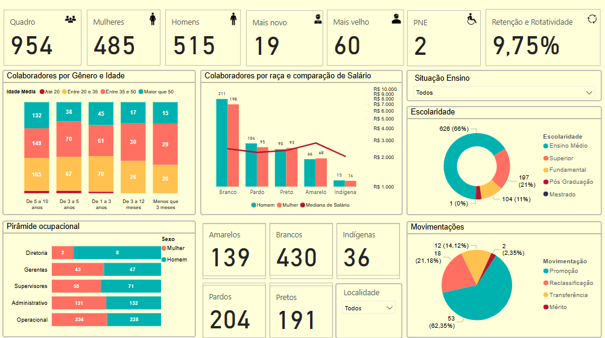

# 📊 Portfólio de People Analytics

Este repositório reúne projetos de **People Analytics** com foco em **diversidade**, **retenção de talentos** e **indicadores estratégicos de RH**, utilizando **dados simulados**.  
A proposta é demonstrar como a análise orientada por dados pode **impulsionar decisões mais estratégicas** no contexto organizacional.

Todos os dados apresentados são fictícios e foram criados com fins exclusivamente educacionais.

---

## 📁 Projetos Incluídos

- **🔎 Dashboard de Diversidade**  
  Análise visual sobre a composição do quadro de colaboradores considerando gênero, raça/cor, PCD, faixa etária, entre outros indicadores.  
  O objetivo é trazer visibilidade para a diversidade organizacional e gerar insights para ações mais inclusivas.

  

    
     
    <em>Visão geral da diversidade organizacional com base em dados simulados.</em>
  

👉 [Clique aqui para visualizar o dashboard no Power BI](https://app.fabric.microsoft.com/view?r=eyJrIjoiMDM2MGZiYzYtZmY1Ny00N2E4LTg1MzQtMjg1MzZlZTdkMmM5IiwidCI6ImY2MGU0YzU5LTdmY2QtNGUwNC1hOTE3LTU4MTVmZjljNjgyYSJ9)

- **🔎 Dashboard Geral de RH** 
Análise visual dos principais indicadores relacionados à retenção, como tempo médio na empresa, taxa de turnover, e perfil dos colaboradores desligados.  
  O objetivo é apoiar estratégias para redução da rotatividade e fortalecimento do engajamento.

 

    
     
    <em>Exemplo dos principais KPIs do RH reunidos em um único painel.</em>
  

---

## 🛠️ Ferramentas Utilizadas

✔️ Power BI • Excel • Simulação de Dados de RH

---

## 👤 Sobre Mim

**Pedro Scriboni Dubovicki**  
Analista de Recursos Humanos com atuação em **People Analytics**, **planejamento estratégico** e **desenvolvimento de pessoas**.  
Apaixonado por dados, por transformar números em histórias e por apoiar decisões que valorizem as pessoas.

📎 [LinkedIn](https://www.linkedin.com/in/dubovicki/)

---

✉️ Sinta-se à vontade para explorar, deixar sugestões ou me chamar para conversar sobre People Analytics!

